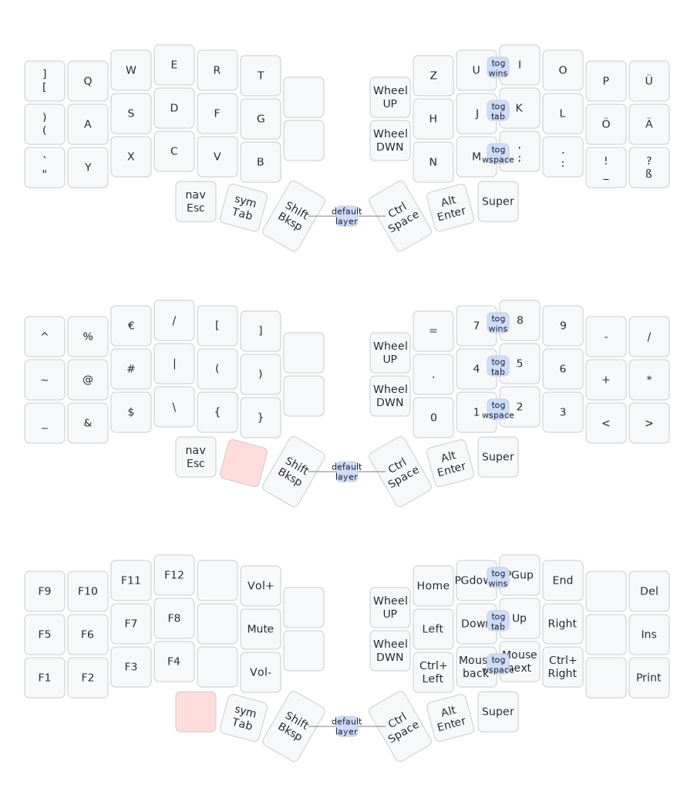

# Keyboard layout

A keyboard layout optimized for ergonomics, compatibility, german language, right handed, and programming.

## Overview

Features:

- corne keyboard: Ergonomic ortholinear split layout. All keys are in reach.
- based on German QWERTZ layout with umlauts
- brackets and punctuation on default layer
- Symbol layer with numpad
- function layer with vim navigation
- character combos to switch tabs, windows, and workspaces
- thumb cluster for modifiers and layer switching

## Layers

- 3 layers: default with characters and most common symbols e.g. punctuations, symbols with more symbols and a numpad, and nav with function keys and a navigation cluster.
- switch layers using the corresponding left thumb cluster key: hold for momentary and double tap for permanent layer switch
- combo of the two innermost thumb cluster keys, i.e. space and backspace to go back to the default layer permanently
- Upper case characters by holding backspace on the default layer (activates left shift). Some symbols, e.g. brackets have alternative shift behavior. Same with Ctrl, Alt and Windows.
- Uses thumb cluster hold instead of home row mod to allow dynamic typing rates
- Thumb cluster and 4 extra keys are persistent across all layers

## Thumb cluster

| action     | L1        | L2            | L3          | R1    | R2       | R3    |
| ---------- | --------- | ------------- | ----------- | ----- | -------- | ----- |
| tab        | Esc       | Tab           | Backspace   | Space | Enter    | Super |
| hold       | mom. nav  | mom. symbols  | Shift       | Ctrl  | Alt      | Super |
| double tab | perm. nav | perm. symbols | remove word | ---   | Launcher | Super |
